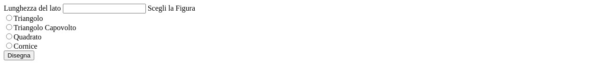

# Esercizi Cavallini

Questo repository contiene una serie di esercizi PHP e HTML, organizzati in cartelle.

## Struttura del Progetto

- `esercitazioneA`: Contiene l'esercizio 1.
- `esercitazioneB`: Contiene l'esercizio 2.
- `esercitazioneBadvanced`: Contiene l'esercizio 2-2.

## Esercizio 1: Disegno di Figure Geometriche (esercitazioneA)

Questo esercizio permette di disegnare diverse figure geometriche (triangolo, triangolo capovolto, quadrato, cornice) specificando la lunghezza del lato.

### Screenshot

#### Input Iniziale

#### Triangolo

#### Triangolo Capovolto

#### Quadrato

#### Cornice

## Esercizio 2: Numeri Primi (esercitazioneB)

Questo esercizio calcola e visualizza i numeri primi fino a un numero specificato.

### Screenshot

#### Input Iniziale

#### Risultato

## Esercizio 2-2: Numeri Primi Avanzato (esercitazioneBadvanced)

Questo esercizio calcola e visualizza i numeri primi tra due numeri specificati.

### Screenshot

#### Input Iniziale

#### Risultato

